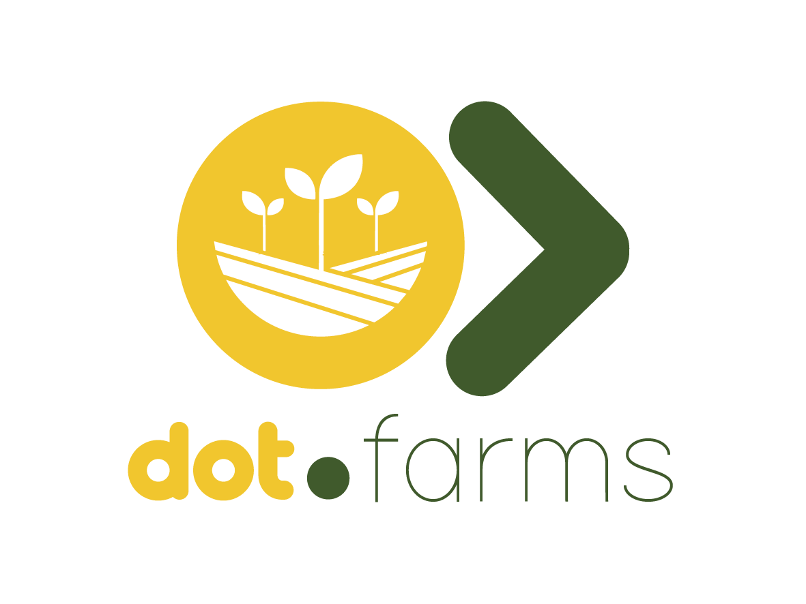

<div align="center">



<br /><br />

**The agriculture ERP for the Dot Ecosystem — farm, field, and crop-cycle tracking from paddock to gate.**

<br />

   

<br /><br />

**Part of the Dot Ecosystem** &nbsp;·&nbsp; `farms.infodot.app`

</div>

---

> **UNVERIFIED SCAFFOLDING.** This codebase was hand-authored in an environment with no PHP,
> Composer, or PostgreSQL available — nothing here has been run, migrated, or tested. It has not
> been executed even once. Review every file before trusting it in a real environment. See
> `wiki.md`'s change log for the exact scope of this pass.

## What is Dot.Farms?

Dot.Farms is the agriculture ERP for the Dot Ecosystem: crop planning, planting and harvest
execution, and yield tracking for farm owners, agronomists, and field operators. It owns the
agriculture domain end-to-end from paddock to gate. Downstream commerce — produce listing and
settlement — belongs to Dot.Emall and Dot.Billing; Dot.Farms hands off the moment produce is
harvest-ready. See `wiki.md` for the full platform description.

## Core Features (MVP)

- Team-scoped farm registry (Jetstream Teams — every farm belongs to exactly one team)
- Field/paddock management per farm, with soil-type and moisture-zone attributes
- A reusable, team-wide crop catalog
- Crop cycles: the planting → harvest lifecycle for one crop, on one field, in one season
- Planting and harvest record-keeping against a crop cycle, with cross-team access enforced by `FarmPolicy`
- Farm dashboard: active fields, crops currently in season, and recent harvests
- In-app notification bell (Laravel's `database` channel), reused verbatim from Dot.Billing
- Ecosystem SSO handoff (`/auth/ecosystem`)

Not in scope for this pass: yield forecasting, weather integration, moisture/sensor telemetry
ingestion, full seasonal-cycle automation, or any outbound event publishing to Dot.Brain/Dot.Emall
(the domain models describe the trigger points; nothing actually fires yet).

## Domain Models

- **Farm** — tenant root (`team_id`)
- **Field** — a paddock within a farm; carries soil-type and moisture-zone
- **Crop** — team-owned catalog entry (e.g. "Maize — Yellow dent"), reused across fields/seasons
- **CropCycle** — the planting → harvest lifecycle for one crop, one field, one season (`season` is a first-class column — see the migration's docblock for why)
- **PlantingRecord** / **HarvestRecord** — operational logs against a crop cycle

## Tech Stack

| Layer | Technology |
|---|---|
| Framework | Laravel 12 |
| Language | PHP 8.3 |
| Frontend | Blade + Alpine.js 3 · Livewire 3 (notification bell) · Tailwind CSS |
| Database | PostgreSQL (shared across ecosystem) |
| Auth | Laravel Sanctum (ecosystem SSO) + Jetstream/Fortify (teams, 2FA) |
| Queue | Database queue driver |

## Quick Start

```bash
git clone https://github.com/sakhilebhayi/Dot.Farms.git
cd Dot.Farms
cp .env.example .env
composer install
npm install && npm run build
php artisan key:generate
php artisan migrate
php artisan db:seed   # optional — loads a realistic two-farm demo dataset
php artisan serve
```

> This has not been run in the environment this scaffolding was authored in. The steps above are
> the standard Laravel/Jetstream bootstrap sequence, not a verified-working script.

### Running Tests

```bash
php artisan test
```

Feature tests use an in-memory SQLite connection (see `phpunit.xml`) and Laravel's RefreshDatabase
trait — no shared Postgres instance required to run them, once PHP/Composer are available.

## Ecosystem

**Dot.Farms** is one of the platforms in the Dot Ecosystem, connected via shared PostgreSQL and
Sanctum SSO, and via Knowledge Packs published to [Dot.Brain](https://github.com/sakhilebhayi/Dot.Brain).
See `wiki.md` for the full architecture and cross-platform relationships.

## License

MIT
