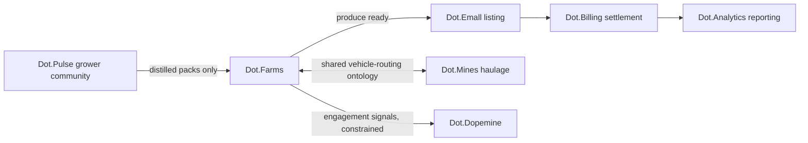

# Dot.Farms

Purpose: this is Dot.Farms's own knowledge home — owned and maintained by the Dot.Farms team. It describes what this platform is, what it manages, and how it connects to the wider Dot Ecosystem. Dot.Brain never edits this file; it only reads what we choose to publish.

> **Related:** [Dot.Brain's ingested view of this platform](https://github.com/sakhilebhayi/Dot.Brain/blob/main/platforms/dot-farms.md)

---

## 1. What Dot.Farms Is

Dot.Farms is the agriculture ERP for the Dot Ecosystem: crop planning, planting and harvest execution, and yield tracking for farm owners, agronomists, and field operators. It owns the agriculture domain end-to-end from paddock to gate. Downstream commerce — produce listing and settlement — belongs to Dot.Emall and Dot.Billing; Dot.Farms hands off at the point produce is harvest-ready.

**Status:** MVP scaffolding exists — a Jetstream Teams shell plus a working agriculture domain layer (models, migrations, controllers, Blade views, a seeder, and feature tests) — but it is **entirely unverified**. This codebase was hand-authored in an environment with no PHP, Composer, or PostgreSQL available; nothing has been run, migrated, tested, or even syntax-checked by a compiler. Treat every file as a first draft that needs a real review pass — schema mismatches, missing imports, or Blade errors are all plausible until someone runs `composer install && php artisan migrate && php artisan test` for real. See the Change Log for exactly what this pass added.

## 2. Design Principle: Own the Field, Not the Sale

Dot.Farms is the system of record for what happens on the farm — soil, crop cycles, water, labor, yield. It is not a marketplace and does not own pricing, listing, or settlement. The moment produce is harvest-ready, ownership of the commercial lifecycle passes to Dot.Emall (listing) and Dot.Billing (settlement); Dot.Farms publishes the trigger event and gets out of the way. Keeping this boundary sharp is what lets the value chain in §6 compose cleanly instead of each platform re-implementing pieces of the others' domains.

**Implementation note:** recording a harvest (`HarvestRecord`) is the code-level stand-in for the `agriculture.harvest.recorded` trigger described in §5. No event is actually published anywhere yet — see the docblock on `App\Models\HarvestRecord`.

## 3. Architecture (as built)

| Layer | Status | Notes |
|---|---|---|
| Jetstream Teams shell | Built (copied from Dot.Billing, adapted) | Auth, teams, 2FA, API tokens, ecosystem SSO handoff (`/auth/ecosystem`), in-app notification bell |
| Field & cycle service | Built (MVP) | Farm/Field registry, Crop catalog, CropCycle (planting → harvest lifecycle), PlantingRecord/HarvestRecord logs — plain controllers + Blade views, team-scoped via `FarmPolicy` |
| Telemetry ingestion | Not built | Moisture/sensor readings — out of MVP scope |
| Logistics & input tracking | Not built | Out of MVP scope |
| Yield & outcomes | Partially built | `HarvestRecord.quantity_harvested` is the ground-truth yield figure; no dedicated forecast-verification model yet |
| Knowledge Pack publisher | Not built | No outbound events or Knowledge Pack payloads are actually emitted |
| Tenant boundary | Built | `Farm.team_id` is the tenant root; `Field`, `CropCycle`, `PlantingRecord`, `HarvestRecord` inherit tenancy through their parent relationship rather than duplicating `team_id` on every table |

## 4. Domain Entities (as built)

| Entity | Model | Natural key | Notes |
|---|---|---|---|
| Farm | `App\Models\Farm` | `team_id` + name | Tenant root; `status` active/inactive |
| Field / paddock | `App\Models\Field` | farm + `code` (unique per farm) | Carries `soil_type` and `moisture_zone`; `status` active/fallow/retired |
| Crop | `App\Models\Crop` | team + name (+ variety) | Team-owned catalog entry, reused across fields and seasons |
| Crop cycle | `App\Models\CropCycle` | field + `season` + crop | Planting → harvest lifecycle; `status` planned/planted/growing/harvested/failed |
| Planting record | `App\Models\PlantingRecord` | cycle + timestamp | Operational log of a planting event |
| Harvest record | `App\Models\HarvestRecord` | cycle + timestamp | Operational log of a harvest event; also today's stand-in for a "yield record" |

Migration: `database/migrations/2026_08_01_100002_create_agriculture_tables.php`.

### Open question resolved: `season` as a first-class field

wiki.md v0.1.0 and Dot.Brain's platform doc both flagged whether `season` should be a first-class column on crop-cycle/pack records or carried only in payload context. This pass resolves it in favor of **first-class**: `crop_cycles.season` is a plain indexed string column, not derived from payload JSON. Rationale: the dashboard needs to answer "what's in season right now" without parsing free-text context on every request, and per-season reporting (e.g. "2026 Summer harvest totals") is a named MVP requirement. This is a code-level decision, not a Dot.Brain integration-mechanics decision — the second open question below (grower-community distillation) is still genuinely open.

## 5. Events We Intend to Emit

| Event | Trigger | Status |
|---|---|---|
| `agriculture.cycle.started` / `agriculture.cycle.completed` | Crop cycle state change | Not emitted — `CropCycle.status` changes happen in-app only |
| `agriculture.moisture.threshold` | Reading crosses a configured band | Not applicable — no telemetry ingestion built |
| `agriculture.harvest.recorded` | Yield record committed — triggers Dot.Emall listing | Not emitted — `HarvestRecordController@store` creates the record and marks the cycle harvested, nothing more |
| `agriculture.incident.reported` | Crop loss or equipment failure | Not built — no incident model exists yet |

Topic naming follows `agriculture.<tenant>.<event>` so per-farm event streams stay isolated by default, once an event bus exists.

## 6. Cross-Platform Relationships

The Farms → Emall → Billing → Analytics chain is the canonical produce-to-revenue value chain. Each arrow is a separate, independently-accepted recommendation — no link in the chain auto-commits the next. None of these links are wired up yet; this diagram remains design intent.

## 7. Tenancy Model

Tenant key is `farm_id` → in code, `farms.team_id`. `FarmPolicy` enforces the boundary at the application layer: a user may view or manage a Farm (and, by extension, its fields, crop cycles, planting records, and harvest records) only if they belong to the farm's owning team. This mirrors the fix Dot.Billing needed for `BillingInvoicePolicy` after a security-review pass found no authorization check on invoice access — Dot.Farms applies the same check from the start. See `tests/Feature/Farms/CrossTeamIsolationTest.php`.

Event topics are intended to be scoped `agriculture.<tenant>.<event>` once an event bus exists (see §5). Cross-tenant aggregation (e.g. regional yield benchmarks) only happens above a minimum distinct-contributor floor, and only from published, distilled data — never raw per-farm rows. Grower-community content arriving via Dot.Pulse is consumed as distilled packs only, not raw feed. Neither of these is implemented; both remain design intent pending the open question in §10.

## 8. Engagement Surface (Dopamine-Aware)

Where Dot.Farms surfaces progress to growers — planting-log completeness, seasonal-goal tracking — it does so only through outcome-anchored signals (did the work actually get done, did the season actually improve), never through engagement metrics like notification click-through or session length. This is a deliberate constraint inherited from the ecosystem's engagement-ethics stance. Not yet implemented in the built dashboard — the current dashboard is a plain operational summary (farm/field counts, crops in season, recent harvests), with no gamified or streak-based surface at all.

## 9. Connecting to Dot.Brain

Dot.Farms participates in the ecosystem as a registered platform (`dot-farms`) that publishes Knowledge Packs about farm operations and consumes recommendations back. Nothing here is implemented yet — no manifest, no publishing pipeline, no ingestion of recommendations.

| Payload type | Cadence | Contains |
|---|---|---|
| `observation` | daily batch | moisture/operations telemetry |
| `insight` | per finding | agronomic correlations |
| `outcome` | per harvest | seasonal yield verification |
| `incident` | per incident | crop-loss / equipment-failure lessons |

Full manifest, entity/event mapping, domain metrics, and a worked publish→PR round-trip example are maintained on the Brain side at [`platforms/dot-farms.md`](https://github.com/sakhilebhayi/Dot.Brain/blob/main/platforms/dot-farms.md) — that document is Dot.Brain's ingested view and is authoritative for integration mechanics; this wiki is authoritative for what Dot.Farms actually *is*.

## 10. Roadmap

- [x] Stand up field & crop-cycle service (farm/field/crop/cycle registry) — **built this pass, unverified**
- [x] Basic CRUD for farms, fields, crops, harvest records — **built this pass, unverified**
- [x] Farm summary dashboard (active fields, crops in season, recent harvests) — **built this pass, unverified**
- [ ] Run the codebase for the first time (`composer install`, migrate, seed, `php artisan test`) — nothing here has ever executed
- [ ] Moisture/sensor telemetry ingestion pipeline
- [ ] Yield recording and seasonal verification against forecast (dedicated model, not just `HarvestRecord`)
- [ ] Harvest-ready → Dot.Emall listing trigger integration (actual event, not just a status flip)
- [ ] Publish the first `observation` Knowledge Pack (hello-pack per Dot.Brain's onboarding procedure)
- [ ] Wire up the four Knowledge Pack payload types end-to-end (observation, insight, outcome, incident)

## Change Log

| Version | Date | Author | Change |
|---|---|---|---|
| 0.4.5 | 2026-08-06 | Platform-loop pass | Redesigned the auth page family (Task 2 of the platform-loop guest-surface pass; Task 1, the welcome-page hero photo, was already done in v0.4.3 and skipped here) to match the palette/type system established on `welcome.blade.php` — `--paper #f7f2e3`, `--paper-deep #efe6cd`, `--ink #26311c`, `--forest #3f5a28`, `--gold #dda52e`, `--soil #8a6239`, `Fraunces`/`Karla`/`Space Mono` — instead of stock Jetstream indigo-on-gray. Confirmed scope first via `grep -rl "x-guest-layout" resources/views/`: exactly the 7 auth pages plus `policy.blade.php`/`terms.blade.php`, both of which render real Jetstream markdown (`resources/markdown/policy.md`/`terms.md`) through `{!! $policy !!}`/`{!! $terms !!}`, not lorem-ipsum, so both were brought into scope and restyled (though `config/jetstream.php`'s `Features::termsAndPrivacyPolicy()` is commented out here, so their routes 404 by design — pre-existing, not caused by this pass; verified the two views still compile cleanly via `php artisan view:cache`). `resources/views/layouts/guest.blade.php`: added the Fraunces/Karla/Space Mono Google Fonts `<link>` tags and the `:root` token block copied verbatim from `welcome.blade.php`, replacing the old Bunny-hosted Figtree link; set body background/text to `bg-[var(--paper)] dark:bg-gray-900` / `text-[var(--ink)] dark:text-gray-100`; left the `localStorage`-backed dark-mode flash-prevention script and toggle button's `onclick`/logic completely untouched, only recoloring the button's static border/bg/text classes to the new palette. `authentication-card.blade.php`: swapped `bg-gray-100`/plain white card for `bg-[var(--paper)]` page background with a bordered (`border-[var(--line)]`), `rounded-xl` white card, matching the hairline-border language used across `welcome.blade.php`'s divided-list sections. `authentication-card-logo.blade.php`: fixed the same undersized-logo mistake flagged in this platform's own v0.4.3 changelog entry (and originally in the Dot.Mines pilot) — Jetstream's default `size-16` (fixed 64×64, cropping the wide lockup) replaced with `h-16 sm:h-20 w-auto`, matching the nav logo's exact sizing from `welcome.blade.php`, not the smaller footer `h-11`. Shared form primitives (`button.blade.php`, `input.blade.php`, `label.blade.php`, `checkbox.blade.php`) had only color/accent tokens swapped, structure untouched: indigo-500 focus rings and gray-800 button fills replaced with `--forest`/`--forest-deep` (light) and `--gold`/`--gold-soft` (dark) accents, label/checkbox text recolored to `--ink-soft`; `input-error.blade.php` and `validation-errors.blade.php` were left completely unchanged since their red-600/red-400 error color is semantic, not a stock-indigo artifact, and swapping it would blur the error-state convention used everywhere else in the app. All 7 auth pages (`login`, `register`, `forgot-password`, `reset-password`, `confirm-password`, `two-factor-challenge`, `verify-email`) got a short `font-mono` eyebrow ("DOT.FARMS") plus a `font-display` heading above the form for orientation, and every inline link/button (forgot-password, already-registered, terms/privacy, recovery-code toggle, edit-profile, log-out) had its `hover:text-gray-900`/`focus:ring-indigo-500` swapped for `hover:text-[var(--forest)]`/`dark:hover:text-[var(--gold)]`/`focus:ring-[var(--gold)]` — no `action`/`method`/`route()`/`@csrf`/`wire:model`/input `name` attributes or `@error` logic touched anywhere. `policy.blade.php`/`terms.blade.php`: recolored the outer wrapper to the paper/card treatment and added `prose-headings:font-display`/`prose-a:text-[var(--forest)]` overrides on top of the untouched `prose dark:prose-invert` class and `{!! $policy/$terms !!}` injection. Verified: `npm run build` clean, `public/build/assets/app-ClYuTgUt.css` 56.86 kB (well above the few-hundred-byte failure signature); local `php artisan serve` on port 8081, checked `/login`, `/register`, `/forgot-password`, `/reset-password/faketoken?email=...` by content, `/user/confirm-password` and `/two-factor-challenge` (both correctly redirect to the restyled `/login`, no fatal error) at 375px and 1600px — `document.documentElement.scrollWidth` matched `innerWidth` at both, no horizontal overflow; dark mode confirmed both directions (page loads dark under a dark system preference with legible paper-on-forest contrast, toggle button switches to the light paper/ink/forest look and back) with the toggle's own script untouched; no console errors. Browser verification ran against a Browser-pane tab shared with the four sibling agents doing the same pass on Dot.Files/Dot.Central/etc. in parallel, which caused several `tabId` collisions mid-session (screenshots/`get_page_text` intermittently returned another platform's page on the same nominal tab) — each was caught by checking the returned tab title/origin before trusting a result, and resolved by closing and recreating the tab; no Dot.Farms file or session state was affected. This worktree-isolated agent session could not run `git` directly against the shared checkout (`/Users/sakhilebhayi/Dot/Dot.Farms`) — the sandbox hard-blocks any `git` invocation, including `-C`, that targets a path outside the agent's own linked worktree — so all edits were made in the worktree, verified by copying the finished files into the shared checkout and building/serving there (the worktree has no `vendor`/`node_modules`/`.env`), then committed from the worktree itself. See the Git section of this session's own report for the resulting commit/branch and the exact fast-forward command needed to land it on `main`. |
| 0.4.4 | 2026-08-06 | Platform-loop pass | Recovered and committed the ecosystem-wide `HasTeamScope` architecture pass (see Dot.Finance `2f75bdb`/Dot.Notify `e671436` for the pattern) that had been done correctly during the earlier rollout but left uncommitted on disk when that session was interrupted. Verified the diff by hand before committing rather than trusting it blind: `app/Models/Concerns/HasTeamScope.php` (new) is a global-scope trait applied to `Farm` and `Crop` — the only two agriculture models with a direct `team_id` column, per the migration's own docblock; `Field`/`CropCycle`/`PlantingRecord`/`HarvestRecord` are correctly left unscoped since they're reached only through their parent chain and already protected by `FarmPolicy`. `CropCycleController`/`HarvestRecordController` had their now-redundant explicit `where('team_id', ...)` reads removed, each with a comment explaining why the trait already covers it; mass-assignment at create time was left untouched. `CrossTeamIsolationTest` had four `assertForbidden()` calls correctly updated to `assertNotFound()` (the same fail-closed 403→404 behavior change documented across the rollout — route-model binding can no longer resolve another team's `Farm`/`Field` before `FarmPolicy` ever runs) plus a new `test_scope_alone_blocks_cross_team_access_even_without_a_policy_check` regression test, mirroring Dot.Finance's pattern. Full suite re-run clean against a real Postgres database: 62 tests, 55 passed, 7 skipped (pre-existing), 0 failed. |
| 0.4.3 | 2026-08-06 | Platform-loop pass | Redesigned `resources/views/welcome.blade.php`, following the same pattern as Dot.Mines' guest-page redesign pilot (`d191d10`/`dfc4547`, wiki v0.3.3): four combined skills (`frontend-design`, `design-taste-frontend-v1`, `emil-design-eng`, `ui-ux-pro-max`) applied to the existing stock-template page rather than to a fresh Mines-style rebuild, since Dot.Farms' prior page (v0.4.0) was itself a generic dark-SaaS scaffold — near-black background, floating blurred orbs, animated pulse dots, gradient-text headline, fabricated three-stat row ("Farm → / Plant → / Season"), and a 3-equal-card feature grid with colored icon boxes — the exact AI-slop pattern the pilot warns against, despite already using real photos and real copy underneath it. Opened the real logo (`public/images/logo.png`) directly and sampled it rather than reusing Mines' gold/umber/warm-ink palette: Dot.Farms' mark is a mustard-gold plowed-field/sprout icon next to a forest-green chevron on white, which points at a *light* warm-paper palette, not a dark one — `--paper #f7f2e3`, `--paper-deep #efe6cd`, `--ink #26311c` (dark forest, not pure black), `--forest #3f5a28`, `--gold #dda52e`, `--soil #8a6239` as the tag/label accent. Typography: `Fraunces` (display serif, farm/food-brand register) + `Karla` (body) + `Space Mono` (labels) — distinct from Mines' `Outfit`/`Plus Jakarta Sans`/`JetBrains Mono` and from Inter. Replaced the centered-hero + 3-card grid with an asymmetric left-aligned hero (real aerial crop-row photo, kept from v0.4.0's sourcing) and two divided-list sections instead of card grids: a 4-row "Plan → Plant → Grow → Harvest" lifecycle list and a 6-item feature list, both hairline-bordered rather than boxed. Signature element: a line-art furrow/plowed-field SVG (converging rows with sprout ticks) echoing the real logo's field icon, replacing Mines' headframe motif with Dot.Farms' own subject matter — shown quietly behind the hero text on large screens only. Copy rewritten from the real wiki §1/§4: removed the fabricated stat row and hype phrasing ("Own the Field, Paddock to Gate" gradient headline, "Ready to Run Your Growing Season?") in favor of concrete claims tied to actual entities (Farm, Field, Crop, CropCycle, PlantingRecord, HarvestRecord; `FarmPolicy` team-scoping). Motion: single restrained scroll-reveal + `scale(0.97)` press-feedback, `prefers-reduced-motion` respected, no perpetual float/pulse animation (removed the v0.4.0 `float-animation` keyframes and ping-pulse status dot). Applied the pilot's own follow-up lesson directly instead of waiting for a review round: nav logo sized `h-16` (mobile) / `h-20` (sm+) and footer logo `h-11`, matching Mines' post-review fix (`dfc4547`, 36px→64/80px nav, 28px→44px footer) rather than repeating its original undersized pass. Verified: `npm run build` clean; local `php artisan serve` preview checked at desktop (1600px), narrow (500px), and mobile (375px) viewports; nav/footer logo legibility confirmed both visually and via `getBoundingClientRect()` (64px/80px/44px as intended) since this session's screenshot tool had the same intermittent capture-timing/blank-frame glitch Mines' pilot log already flagged as unrelated to the page — cross-checked every suspect render against `getComputedStyle` (opacity, color, `is-visible` class) and `document.documentElement.scrollWidth` to confirm no real contrast or overflow issue, and found one real bug this way: the hero's diagonal photo-reveal gradient (tuned for a wide desktop text column) left mobile-width hero text under-contrasted once the text spanned nearly the full viewport, fixed by gating that gradient to `lg:` and giving small screens a strong uniform paper scrim instead. No console errors at any breakpoint. Preview server stopped after verification.
| 0.4.2 | 2026-08-04 | Platform-loop pass | Ecosystem-wide sweep for the null-`currentTeam` crash pattern found in Dot.Mines (commit `0cc4362`): a user removed from their last team reaches an authenticated route with `current_team_id` null, and any unguarded `->currentTeam->id` access crashes. Dot.Farms has no `EnsureTeamContext`-style middleware at all — `routes/web.php`'s protected group only runs `auth:sanctum`, the Jetstream session driver, and `verified`; nothing guarantees `currentTeam` is non-null before a request reaches a route closure or controller action, so the gap is real here too. Found and fixed three unguarded occurrences: (1) `routes/web.php:26-29` — the `/dashboard` closure read `auth()->user()->currentTeam` and immediately dereferenced `$team->id` with no null check; added a null guard that redirects to `teams.create` (confirmed present via `php artisan route:list`, registered by Jetstream's own `teams/create` route). (2) `app/Http/Controllers/Farms/FarmController.php` `store()` — read `$request->user()->currentTeam->id` directly when building the new `Farm`; `FarmPolicy::create()` returns `true` unconditionally so a no-team user reaches this line. Added a private `resolveCurrentTeam()` helper and an `abort(403, 'No active team selected.')` guard, since `store()` is a POST action reachable only after a form has already loaded (mirrors Dot.Mines' `acknowledgeAlert` treatment). (3) `app/Http/Controllers/Farms/CropController.php` `store()` — same pattern, same fix (`CropController` has no policy at all guarding `create`, so this was the only thing standing between a no-team user and a crash). Verified safe and left unchanged: `app/Models/Concerns/HasTeamScope.php` (the ecosystem-wide global-scope trait already applied to `Farm` and `Crop`) explicitly no-ops when `Auth::user()->currentTeam` is null rather than crashing — read-path queries are unaffected by a null current team, only the two write paths above were exposed. `FieldController`, `CropCycleController`, `PlantingRecordController`, `HarvestRecordController` never touch `currentTeam` directly; they authorize through `FarmPolicy` and parent-chain `abort_unless` checks instead. Added regression tests: `tests/Feature/Farms/DashboardTest.php::test_authenticated_user_with_no_team_is_redirected_to_team_creation`, `tests/Feature/Farms/FarmCrudTest.php::test_user_with_no_team_cannot_create_a_farm`, and a new `tests/Feature/Farms/CropCrudTest.php` (`test_team_member_can_create_a_crop`, `test_user_with_no_team_cannot_create_a_crop` — no prior test file existed for `CropController`). Also noted but out of scope for this pass: `CropController` has no dedicated Policy class at all (unlike `FarmPolicy`), so `create`/`index`/`store` have no authorization gate beyond authentication — worth a follow-up. Full suite run against real PostgreSQL: 62 tests, 55 passed, 7 skipped (pre-existing, unrelated to this pass), 0 failed. |
| 0.4.1 | 2026-08-03 | Sakhile Bhayi | Fixed a lingering branding gap: `application-logo.blade.php` (and, where present, `application-mark.blade.php`) still rendered Jetstream's stock placeholder SVG wordmark in the app sidebar/nav and other authenticated-app surfaces, even though the login page's own `authentication-card-logo.blade.php` and the marketing welcome page already used the real logo. These two components render on every authenticated page via Jetstream's own layout, so the placeholder was visible constantly, not just on one screen. Swapped to the real logo file, matching the asset path already used elsewhere in this repo. |
| 0.4.0 | 2026-08-03 | Sakhile Bhayi (Claude Sonnet 5, AI-assisted) | Redesigned `resources/views/welcome.blade.php`, replacing the stock Laravel starter-kit scaffold (Laravel wordmark SVG, unstyled default layout) with a real Dot.Farms marketing page. Nav and footer brand marks now use the real `public/images/logo.png` lockup instead of the Laravel logo. Hero section background: real aerial crop-field-rows photo by RECEP TİRYAKİ (@receqtryaki), unsplash.com/photos/an-aerial-view-of-a-farm-field-with-rows-of-crops-ATspM7IEDoI. CTA section background: real sunset-over-farm-field photo by Mihail Ilchov (@archange1michael), unsplash.com/photos/the-sun-is-setting-over-a-farm-field-p6LxxduM5x0. Both hotlinked via Unsplash's CDN (images.unsplash.com); photographer credit kept as an inline HTML comment above each background declaration. Both image URLs verified to resolve (`curl -sI` returned `HTTP/2 200`) before use. Dark gradient overlays added on both photo sections for text contrast. Copy rewritten to reflect the actual agriculture domain from §1 (crop planning, planting/harvest execution, yield tracking, farm/field/crop-cycle entities from §4) rather than generic marketing filler; accent color chosen as emerald/green (the stock scaffold had no existing brand palette to preserve — it was unstyled Laravel red). Existing `@guest`/`@auth`/`Route::has('login')` logic preserved unchanged. |
| 0.1.0 | 2026-08-01 | Farms Platform Lead | Initial wiki: architecture blueprint derived from Dot.Brain's platforms/dot-farms.md, adapted to platform-owned framing for an empty repository |
| 0.3.0 | 2026-08-02 | Sakhile Bhayi | **Executed for real, for the first time.** `composer install`, `migrate` (10 migrations), and the full test suite ran clean against real PHP 8.5 + PostgreSQL — 57 tests, 50 passed, 7 skipped by config, 0 failed, including all 4 `CrossTeamIsolation` tests and all `FarmCrud`/`FieldCrud` tests, previously verified by review only. Also fixed a real gap found in the process: `storage/framework/{cache,sessions,views}` were missing their `.gitignore` placeholders (only `testing/` had one), so `composer install` generated real cache/view files that would have been accidentally committed; added the missing placeholders. Guarded the six shared Jetstream-core migrations per Dot.Brain adr/ADR-0013. |
| 0.2.0 | 2026-08-01 | Farms Platform Lead (hand-authored, AI-assisted, unverified) | First real code: Jetstream Teams shell copied and adapted from Dot.Billing (Fortify/Jetstream actions, Team/User/Membership/TeamInvitation models, TeamPolicy, providers, config, migrations, generic views); new agriculture domain layer (Farm, Field, Crop, CropCycle, PlantingRecord, HarvestRecord — models, one grouped migration, `FarmPolicy` for cross-team isolation, controllers, Blade CRUD views, a two-farm demo seeder); resolved the `season` first-class-field open question (§4); real Dot.Farms logo and generated favicons wired into the layout; Feature tests for dashboard, farm/field CRUD, and cross-team isolation added alongside the copied generic Jetstream tests. **Written and reviewed with no PHP/Composer/PostgreSQL available in the authoring environment — none of it has been executed.** |
| 0.2.1 | 2026-08-01 | Farms Platform Lead (incremental pass, review-only) | IDOR re-verification pass, prompted by the same bug class (unchecksummed argument/unscoped lookup fetching another team's record by ID) found this session in Dot.Agents, Dot.Pulse, and Dot.Mines' ReportController. Read `FarmPolicy` and all six controllers (`FarmController`, `FieldController`, `CropCycleController`, `PlantingRecordController`, `HarvestRecordController`, `CropController`) plus `routes/web.php` and the one Livewire component (`NotificationBell`) end to end. Finding: **clean, no fix needed.** `FarmPolicy` is unweakened since its original build — `view`/`update`/`delete` still gate strictly on `$user->belongsToTeam($farm->team)`. Every farm-scoped controller action calls `Gate::authorize('view'|'update', $farm)` before touching data, and every nested route (`Field`, `CropCycle`, `PlantingRecord`, `HarvestRecord`) additionally checks its parent-chain ownership (`abort_unless($field->farm_id === $farm->id, 404)` etc.) rather than trusting route-model-bound IDs alone. `HarvestRecordController@show` — the one route bound directly by a bare `{harvestRecord}` ID with no farm/field ancestors in the URL — authorizes via `Gate::authorize('view', $harvestRecord->cropCycle->field->farm)` before rendering, so it does not regress into the IDOR pattern found elsewhere today. `CropController` has no policy checks, but it only ever creates/lists scoped to `$request->user()->currentTeam->id` and never fetches a record by a caller-supplied ID, so it is not exposed to the same class of bug. The one Livewire component, `NotificationBell`, resolves `markAsRead($notificationId)` through `auth()->user()->notifications()->where('id', $notificationId)`, i.e. scoped to the authenticated user's own relation, not a global lookup — no unchecksummed-argument IDOR there either. `tests/Feature/Farms/CrossTeamIsolationTest.php` already exercises farm/field/harvest cross-team denial and an unauthorized field-creation attempt; no new test added since no gap was found. No other small, bounded, named roadmap gap fit this pass's scope — remaining roadmap items (telemetry ingestion, Dot.Emall trigger integration, Knowledge Pack publishing) are all cross-platform or require a real run, per §5/§10, not incremental single-pass work. |

## Open Questions

- ~~Season scoping: should `season` be a first-class field on crop-cycle and pack records, or carried in payload context only?~~ **Resolved for the application layer in v0.2.0** — see §4. The Dot.Brain-side Knowledge Pack payload question (does the pack schema itself need a first-class `season` field, separate from the app's own DB column) is still open and owned by Dot.Brain's Agriculture Agent per their platform doc.
- Grower-community packs arrive via Dot.Pulse distillation — does Dot.Farms need its own distillation view, or is Pulse's sufficient for our needs? Still open; nothing in this pass touches Pulse integration.
- Sensor/telemetry vendor strategy: build ingestion generically or integrate against a first vendor to start? Still open; no telemetry ingestion exists yet.
- This entire codebase needs a first real run in an environment with PHP 8.3, Composer, and PostgreSQL before any of the above can be trusted — see Roadmap.
