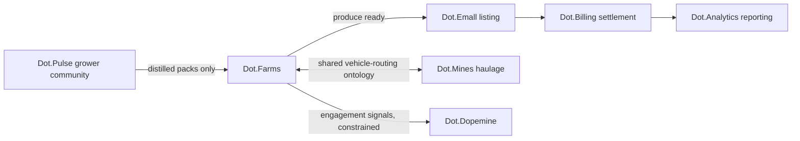

# Dot.Farms

Purpose: this is Dot.Farms's own knowledge home — owned and maintained by the Dot.Farms team. It describes what this platform is, what it manages, and how it connects to the wider Dot Ecosystem. Dot.Brain never edits this file; it only reads what we choose to publish.

> **Related:** [Dot.Brain's ingested view of this platform](https://github.com/sakhilebhayi/Dot.Brain/blob/main/platforms/dot-farms.md)

---

## 1. What Dot.Farms Is

Dot.Farms is the agriculture ERP for the Dot Ecosystem: crop planning, planting and harvest execution, irrigation and moisture management, input logistics, and yield tracking for farm owners, agronomists, and field operators. It owns the agriculture domain end-to-end from paddock to gate. Downstream commerce — produce listing and settlement — belongs to Dot.Emall and Dot.Billing; Dot.Farms hands off at the point produce is harvest-ready.

**Status:** early-stage. This repository does not yet contain application code — the LICENSE file is the only thing checked in. This wiki is the architecture blueprint the implementation will follow, derived jointly from Dot.Brain's ingestion-side description of this platform and the ecosystem's own conventions. Treat every section below as design intent, not shipped behavior, until the change log says otherwise.

## 2. Design Principle: Own the Field, Not the Sale

Dot.Farms is the system of record for what happens on the farm — soil, crop cycles, water, labor, yield. It is not a marketplace and does not own pricing, listing, or settlement. The moment produce is harvest-ready, ownership of the commercial lifecycle passes to Dot.Emall (listing) and Dot.Billing (settlement); Dot.Farms publishes the trigger event and gets out of the way. Keeping this boundary sharp is what lets the value chain in §6 compose cleanly instead of each platform re-implementing pieces of the others' domains.

## 3. Planned Architecture

| Layer | Responsibility |
|---|---|
| Field & cycle service | Farm/field/paddock registry, crop-cycle lifecycle (planting → harvest) |
| Telemetry ingestion | Moisture and sensor readings, daily-resolution time series |
| Logistics & input tracking | Input procurement, harvest logistics, transport dispatch |
| Yield & outcomes | Yield records, seasonal verification against forecasts |
| Knowledge Pack publisher | Batches observations/insights/outcomes/incidents for Dot.Brain ingestion |
| Tenant boundary | Per-farm isolation; `farm_id` is the tenant key throughout |

No implementation exists yet for any of these layers. This table is the intended shape, not a status report.

## 4. Domain Entities

| Entity | Natural key | Notes |
|---|---|---|
| Farm | `farm_id` | Tenant root |
| Field / paddock | farm + field code | Carries soil-type and moisture-zone attributes |
| Crop cycle | field + season + crop | Planting → harvest lifecycle |
| Planting / harvest log | cycle + timestamp | Operational record of field activity |
| Moisture reading | sensor + timestamp | Daily resolution; feeds irrigation scheduling |
| Yield record | cycle | Ground truth for seasonal verification against forecast |

## 5. Events We Intend to Emit

| Event | Trigger | Frequency (expected) |
|---|---|---|
| `agriculture.cycle.started` / `agriculture.cycle.completed` | Crop cycle state change | high-volume, ecosystem-wide |
| `agriculture.moisture.threshold` | Reading crosses a configured band | bursty, seasonal |
| `agriculture.harvest.recorded` | Yield record committed — triggers Dot.Emall listing | seasonal peaks |
| `agriculture.incident.reported` | Crop loss or equipment failure | low, irregular |

Topic naming follows `agriculture.<tenant>.<event>` so per-farm event streams stay isolated by default.

## 6. Cross-Platform Relationships

The Farms → Emall → Billing → Analytics chain is the canonical produce-to-revenue value chain. Each arrow is a separate, independently-accepted recommendation — no link in the chain auto-commits the next.

## 7. Tenancy Model

Tenant key is `farm_id`. Event topics are scoped `agriculture.<tenant>.<event>`. Cross-tenant aggregation (e.g. regional yield benchmarks) only happens above a minimum distinct-contributor floor, and only from published, distilled data — never raw per-farm rows. Grower-community content arriving via Dot.Pulse is consumed as distilled packs only, not raw feed.

## 8. Engagement Surface (Dopamine-Aware)

Where Dot.Farms surfaces progress to growers — planting-log completeness, seasonal-goal tracking — it does so only through outcome-anchored signals (did the work actually get done, did the season actually improve), never through engagement metrics like notification click-through or session length. This is a deliberate constraint inherited from the ecosystem's engagement-ethics stance, not a limitation we plan to relax later.

## 9. Connecting to Dot.Brain

Dot.Farms participates in the ecosystem as a registered platform (`dot-farms`) that publishes Knowledge Packs about farm operations and consumes recommendations back.

| Payload type | Cadence | Contains |
|---|---|---|
| `observation` | daily batch | moisture/operations telemetry |
| `insight` | per finding | agronomic correlations |
| `outcome` | per harvest | seasonal yield verification |
| `incident` | per incident | crop-loss / equipment-failure lessons |

We intend to consume Dot.Brain recommendations on irrigation/moisture scheduling, planting-window optimization, harvest-logistics pre-positioning, and produce listing-timing. Full manifest, entity/event mapping, domain metrics, and a worked publish→PR round-trip example are maintained on the Brain side at [`platforms/dot-farms.md`](https://github.com/sakhilebhayi/Dot.Brain/blob/main/platforms/dot-farms.md) — that document is Dot.Brain's ingested view and is authoritative for integration mechanics; this wiki is authoritative for what Dot.Farms actually *is*.

## 10. Roadmap

- [ ] Stand up field & crop-cycle service (farm/field/cycle registry)
- [ ] Moisture/sensor telemetry ingestion pipeline
- [ ] Yield recording and seasonal verification against forecast
- [ ] Harvest-ready → Dot.Emall listing trigger integration
- [ ] Publish the first `observation` Knowledge Pack (hello-pack per Dot.Brain's onboarding procedure)
- [ ] Wire up the four Knowledge Pack payload types end-to-end (observation, insight, outcome, incident)

## Change Log

| Version | Date | Author | Change |
|---|---|---|---|
| 0.1.0 | 2026-08-01 | Farms Platform Lead | Initial wiki: architecture blueprint derived from Dot.Brain's platforms/dot-farms.md, adapted to platform-owned framing for an empty repository |

## Open Questions

- Season scoping: should `season` be a first-class field on crop-cycle and pack records, or carried in payload context only?
- Grower-community packs arrive via Dot.Pulse distillation — does Dot.Farms need its own distillation view, or is Pulse's sufficient for our needs?
- Sensor/telemetry vendor strategy: build ingestion generically or integrate against a first vendor to start?
